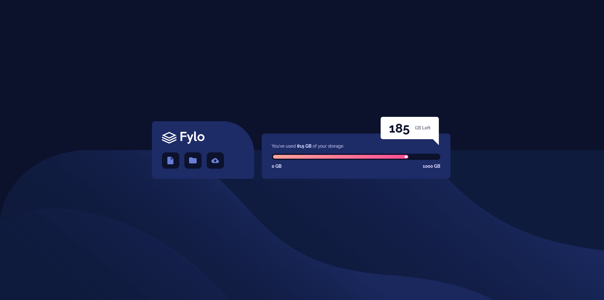
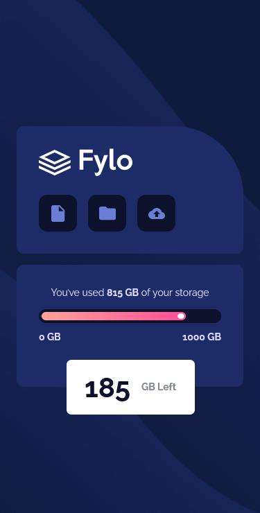

# Frontend Mentor - Fylo data storage component solution

This is a solution to the [Fylo data storage component challenge on Frontend Mentor](https://www.frontendmentor.io/challenges/fylo-data-storage-component-1dZPRbV5n). Frontend Mentor challenges help you improve your coding skills by building realistic projects.

## Table of contents

- [Overview](#overview)
  - [The challenge](#the-challenge)
  - [Screenshot](#screenshot)
  - [Links](#links)
- [My process](#my-process)
  - [Built with](#built-with)
  - [What I learned](#what-i-learned)
  - [Continued development](#continued-development)
  - [Useful resources](#useful-resources)
- [Author](#author)

## Overview

### The challenge

Users should be able to:

- View the optimal layout for the site depending on their device's screen size

### Screenshot




### Links

- Solution URL: [Solution](https://github.com/fidellim/Fylo-Data-Storage-Component)
- Live Site URL: [Live Site](https://zen-noyce-7dca11.netlify.app/)

## My process

### Built with

- Semantic HTML5 markup
- SASS
- Flexbox
- Mobile-first workflow

### What I learned

I was able to practice the use of BEM convention.

```css
.container--normal {
	width: 100%;
	max-width: 600px;
	min-width: 500px;
	align-self: flex-end;
}
.container__text--center {
	text-align: left;
}
.progBarTextContainer {
	margin-bottom: 0rem;
}
```

### Continued development

To be able to be more familiar with BEM convention

### Useful resources

- [BEM Convention](http://getbem.com/) - This is a guide for following the BEM convention for CSS.

## Author

- Website - [Fidel Lim](https://fidellim-portfolio.netlify.app/)
- Frontend Mentor - [@fidellim](https://www.frontendmentor.io/profile/fidellim)
- Github - [@fidellim](https://github.com/fidellim)
